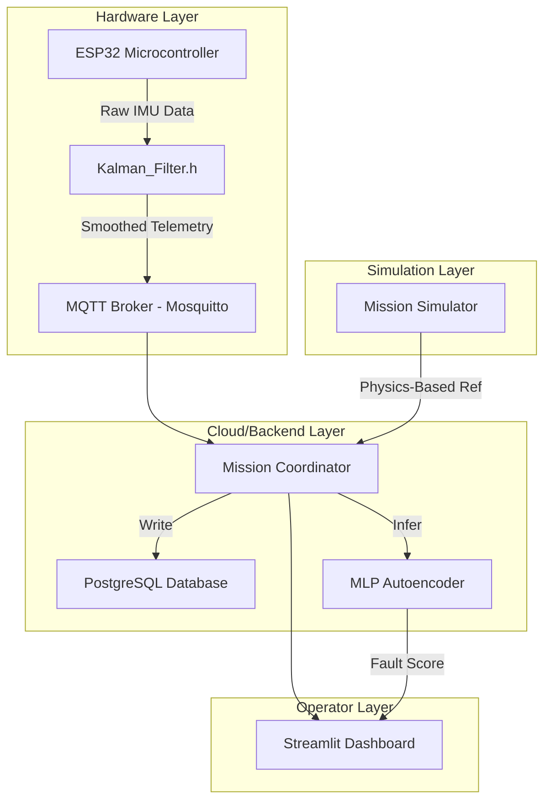

# 🚀 Astraeus-9-C-C: Hybrid Orbital Re-Entry Mission Control

<div align="center">

[](https://python.org)
[](https://www.arduino.cc/)
[](https://docker.com)
[](https://streamlit.io)
[](LICENSE)

**Astraeus-9** is a fault-tolerant mission control system for orbital re-entry monitoring. It integrates an ESP32 embedded sensing kernel with Kalman filtering, a physics-based re-entry simulator, and an ML-powered anomaly detection dashboard to achieve real-time hardware degradation detection.

</div>

---

## 1. ⚡ The Problem: Re-Entry Hardware Degradation

During orbital re-entry, spacecraft experience extreme conditions that cause silent hardware failures:

| # | Stress Factor | Physical Impact | Technical Risk |
|---|---------------|-----------------|----------------|
| 1 | **Radiation Damage** | Cosmic ray bit-flips | Corrupted sensor data / state estimation drift |
| 2 | **Thermal Stress** | Atmospheric friction | Sensor bias and mechanical expansion |
| 3 | **Structural Vibration** | Increasing atmospheric drag | High-frequency noise in IMU telemetry |

---

## 2. 🚀 The Solution: Astraeus-9 Hybrid Approach

Astraeus-9 uses a three-technology hybrid approach for mission assurance:

| # | Technology | Implementation | Benefit |
|---|------------|----------------|---------|
| 1 | **Embedded Kernel** | ESP32 + Kalman_Filter.h | Real-time hardware state estimation |
| 2 | **Physics Simulation** | Atmospheric drag & decay modeling | Golden-reference trajectory matching |
| 3 | **ML Anomaly Detection** | MLP Autoencoder (PyTorch) | Reconstruction-error based fault scoring |

---

## 3. 👥 Team Contributions

### 3.1 Pooja Kiran - Lead AI Systems Architect

| # | Domain | Contribution Details | Specifications |
|---|--------|---------------------|----------------|
| 1 | **Embedded Kalman Filter** | Designed the `Kalman_Filter.h` C++ library for ESP32 real-time smoothing | Low-latency state estimation on edge |
| 2 | **Re-Entry Physics Engine** | Developed physics-driven simulator for atmospheric drag and orbital decay | 550km to 0km trajectory modeling |
| 3 | **ML Anomaly Engine** | Built the PyTorch MLP Autoencoder for reconstruction-error fault detection | Offline training, online real-time scoring |
| 4 | **Hardware Integration** | Orchestrated the I2C communication between ESP32 and IMU sensors | High-frequency sampling (100Hz+) |
| 5 | **State-Space Modeling** | Defined the 6-DOF transition matrices for the Kalman estimator | Accurate position/velocity tracking |

### 3.2 Rhutvik Pachghare - Robotics Systems & DevOps Engineer

| # | Domain | Contribution Details | Specifications |
|---|--------|---------------------|----------------|
| 1 | **Mission Control Dashboard** | Engineered the Streamlit real-time monitoring interface (`src/dashboard/`) | MQTT-to-UI data pipeline visualization |
| 2 | **MQTT Communication** | Configured the Mosquitto broker bridge between ESP32 hardware and Python backend | Zero-packet-loss telemetry transport |
| 3 | **Docker Orchestration** | Designed the 3-service container architecture (Postgres, MQTT, Streamlit) | One-command deployment workflow |
| 4 | **Database Schema** | Built the Postgres relational model for mission-critical telemetry persistence | Time-series data indexing |
| 5 | **CI/CD & Documentation** | Governed repository structure, README technical mapping, and engineering focus | CODEOWNERS domain attribution |

---

## 4. 🏗️ System Architecture



---

## 5. 🚀 Quick Start

### 5.1 Hardware Setup

1. Flash the ESP32 using the code in `src/embedded/`
2. Connect MPU6050 via I2C (SDA/SCL)
3. Ensure ESP32 is on the same network as the MQTT Broker

### 5.2 Software Deployment

```bash
# 1. Clone & Enter
git clone https://github.com/Rhutvik-pachghare1999/Astraeus-9-C-C.git
cd Astraeus-9-C-C

# 2. Launch Stack
docker-compose up --build
```

---

## 6. 📊 Anomaly Detection Logic

| # | Metric | Implementation | Fault Condition |
|---|--------|----------------|-----------------|
| 1 | **Kalman Innovation** | Measurement Residual | > 3-sigma → Hardware Bias |
| 2 | **Autoencoder Error** | Reconstruction Loss | > Threshold → Structural Anomaly |
| 3 | **Physics Divergence** | Simulated vs Actual | > 5% → Aerodynamic Failure |

---

## 7. 🧹 Testing & Validation

```bash
# Run backend validation
pytest tests/ -v

# Run hardware loop tests
python scripts/test_mqtt_throughput.py
```

---

## 8. 📜 License

Distributed under the **MIT License**. See `LICENSE` for details.

---

## 9. 👤 Author

**Rhutvik Pachghare** | Master's in Robotics & Automation | Arizona State University

- [GitHub](https://github.com/Rhutvik-pachghare1999)
- [LinkedIn](https://www.linkedin.com/in/rhutvik-pachghare/)
